# KBD75v2
My first attempt at building a keyboard will be with the [KBDFans 75v2](https://kbdfans.com/products/kbd75v2-custom-keyboard-diy-kit).  I wasn't sure about parting ways with the F-row, as I use IntelliJ quite often, therefore I decided to go with the 75% profile to keep that row.

## Bill of Materials

Components I acquired for this build:

 - [KBDFans 75v2](https://kbdfans.com/products/kbd75v2-custom-keyboard-diy-kit) Kit with PCB, plate, case, stabilizers, and case foam.
 - [Cherry MX Silent Red Switches](https://kbdfans.com/products/cherry-mx-silent-red) I'm used to louder reds and blues and wanted to try a silent variety.
 - [SA Retro Graffiti Caps](https://kbdfans.com/products/domikey-doubleshot-abs-sa-retro-graffiti-full-set-keycaps) I wanted to try the SA profile as they remind me of the caps I had on some of my first PCs.

Other components that were already on hand:

  - Soldering Iron (I think mine is X-Tronic Model #3020)
  - Solder Sucker
  - Kester Solder (I had SN63 PB37 @ 0.031")
  - Silicone Soldering Mat
  - Tweezers, Scissors, Side-Cutters
  - Teflon Grease
  - Glasses (for safety and readers to inspect small parts and lettering)
  - Coffee (Counter Culture Forty-Six)

## Taking Inventory
Starting with the PCB and plate.  I needed to get my bearings.  Which way is face-up and which way is North/South on this thing.  (USB connector is on bottom side and in the upper left corner so that helps.)

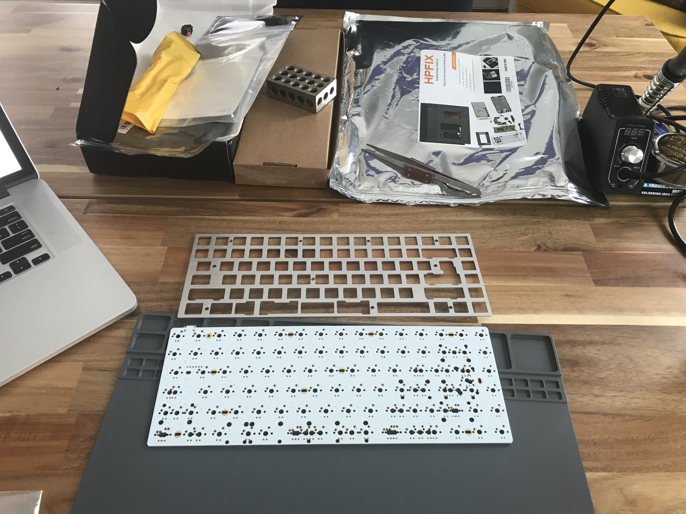

Something that I noticed on the board is that there was a small cluster of spare parts (resistors and diodes).  Not sure if this is common but I appreciated it.

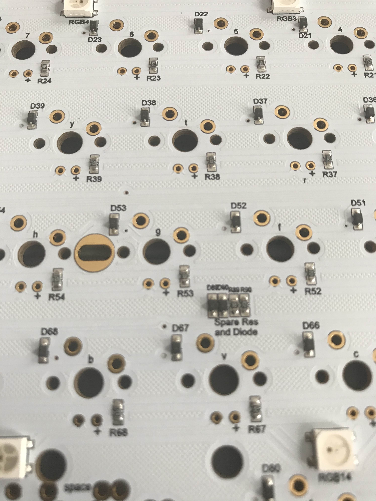

A closer look at the bottom side of the board shows us the microcontroller.  In this case an [ATMEGA-32u4](https://www.microchip.com/wwwproducts/en/ATmega32u4) with what looks like a 16Mhz crystal above and a reset button below.  I also just noticed the points for [ISP](https://en.wikipedia.org/wiki/In-system_programming).  Additionally, you can see the RBG LEDs for under-lighting that this PCB offers.

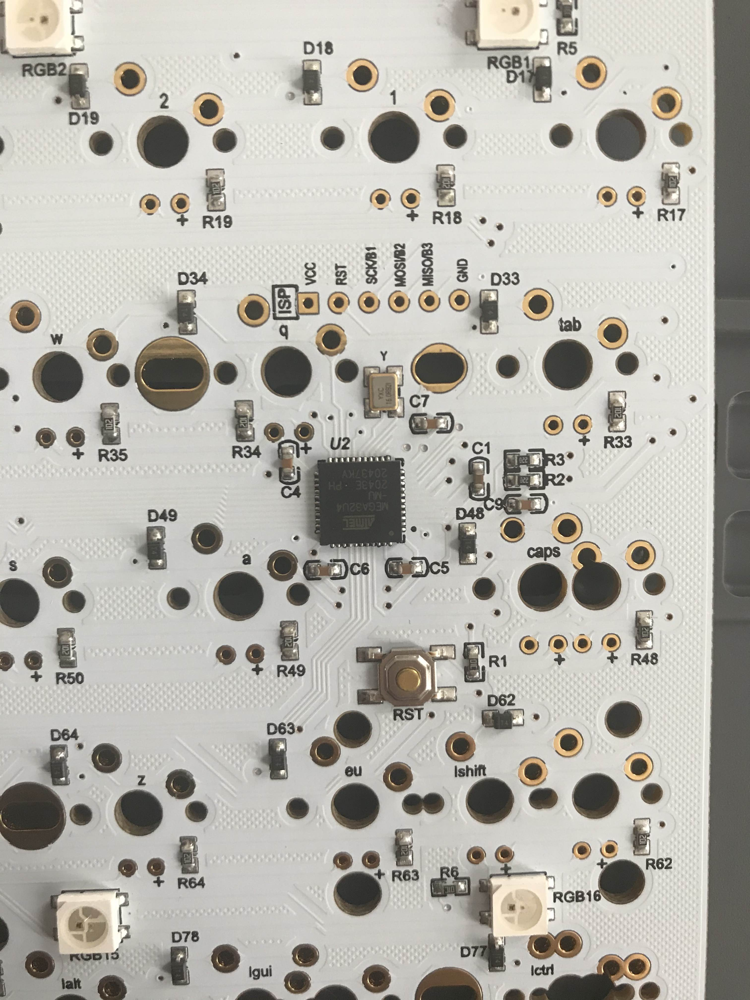

## First Assembly (and first mistakes)
I noticed that most of the PCB suppliers recommend that before you do any assembly you test each switch location.  Plugging the keyboard in and using a pair of tweezers to momentarily connect the two points for each switch while tracking the activated keys with a [keyboard testing application](https://www.keyboardtester.com/) showed that everything was OK.

Next..  Well what do you do next?  Do you put switches on the PCB and then the plate on top?  And where do these stabilizers go exactly?  I reviewed the information in this [Techspot article](https://www.techspot.com/guides/1629-diy-build-your-own-mechanical-keyboard-part-2/) and determined that I should start with the stabilizers.

For my build I have what I think are Cherry style stabilizers (clip or snap in variety).  I referenced this [Switch and Click article](https://switchandclick.com/stabilizer-guide/) on how to identify and improve stabilizers which involves band-aids, clipping, and lubrication.

I started this phase by taking a stabilizer apart and discovered that the clipping modifications were not necessary/possible.  (I'm not sure if this is due to a misidentification on my part or if there are different Cherry style stabilizers out there).  As recommended in the Switch and Click article](https://switchandclick.com/stabilizer-guide/) I cut up a band-aid and applied below the backspace and space bar (I felt that these are more often used).  Finally, a liberal amount of lube was added to the plastic-on-plastic bearing surface as well as the area where the metal bar clips in.

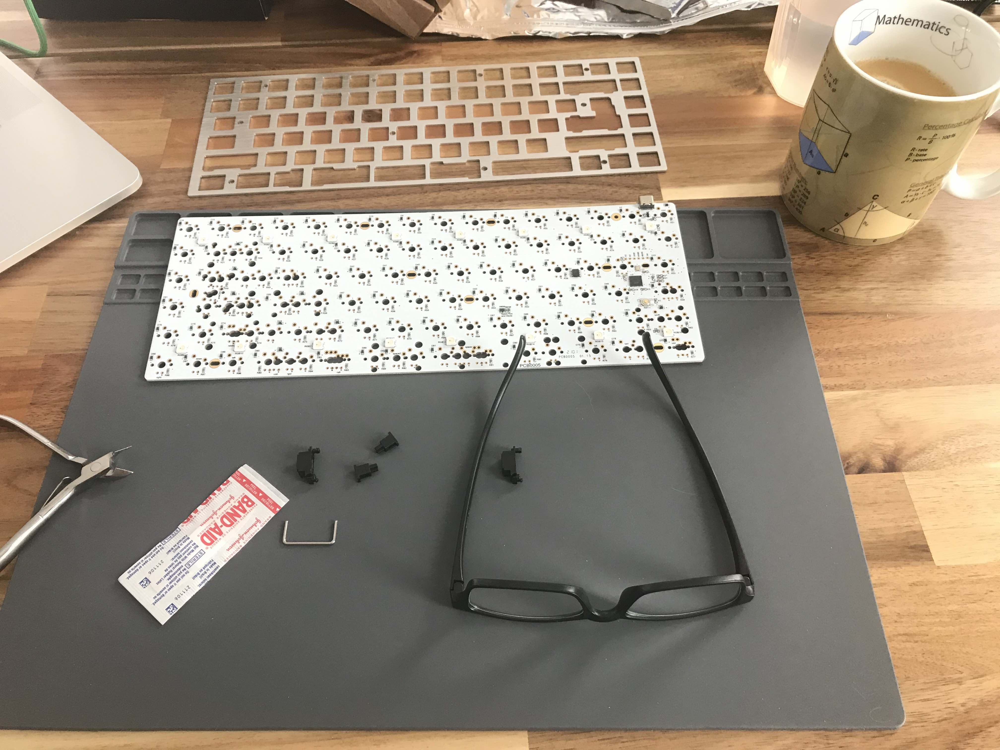

With the stabilizers prepared I attached them by pressing into the PCB (click).  Now time to take a look at the switches that I am using.  There are a [few options](https://www.cherrymx.de/en/dev.html) for the switches.  There is a switch with and without extra PCB mounting pins.  In looking at what I ordered I was able to determine that I had the variety where you mount/clip directly into the keyboard metal plate.

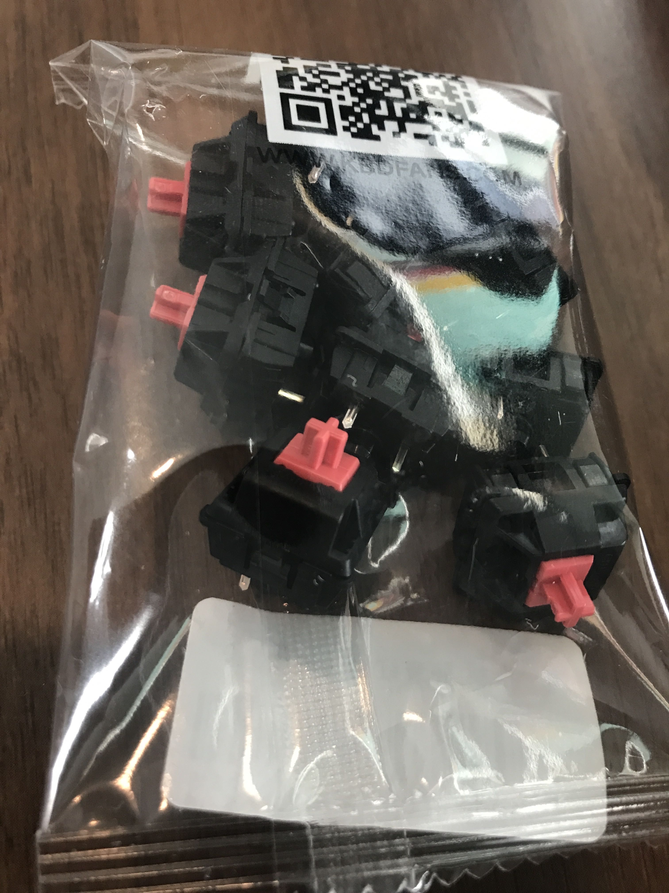

I placed a few of the switches into the plate, making sure to orient them in a direction that the contact pins are aligned with the through holes in the PCB (this is what makes contact when you press the switch).  

I spaced a few keys closer to the edges thinking that it will help in overall alignment of the plate and PCB.  I wasn't was not sure how much play there is this plate to PCB setup and I didn't want to start working from one side then get to the other only to find that small errors along the way had compounded to the point where the last few switches don't align.

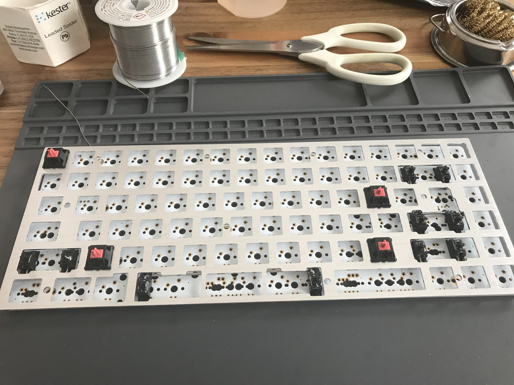

At this point I began to solder the switch contact pins to the underside of the PCB.  Plenty of space to work with and get the iron tip in and apply solder.  So no real problems here.  I started to move along at a steady pace.

I then noticed a mistake.  I had put a stabilizer across the area for the Right-Shift key thinking that this was required.  When I referenced a sample image of a completed build I noticed that I needed to squeeze both an Up and End key to the right of that Right-Shift key.  With the stabilizer sitting across that spot I couldn't fit the Up key in.  Time to correct this mistake.  In order to get that stabilizer out it seems that I would need to remove the plate - as the stabilizers are installed on the PCB first and then the plate with keys on top of that (sandwiching the stabilizer between the PCB and plate).  This meant that the keys that I had just soldered would also need to be desoldered so that the plate could be lifted up enough to allow the stabilizer to be removed.

With this mistake corrected I went about placing more switches and soldered them in place.  (Notice the nice little pile of solder removed by the desoldering sucker - this thing works very well once you get the hang of it.)

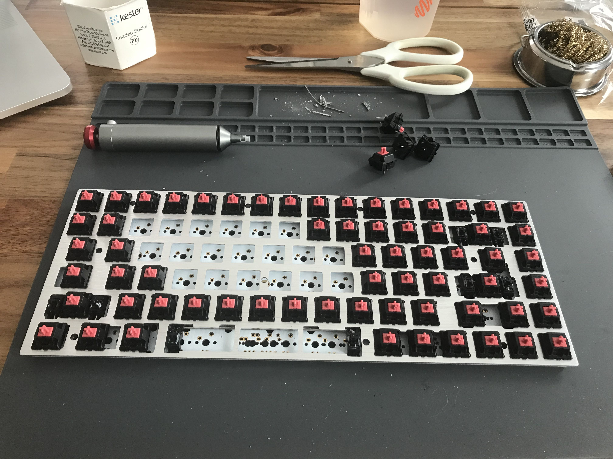

And now here we are with all the switches in place and the keyboard plugged in and once again we go about checking each of the switches with the same [keyboard testing application](https://www.keyboardtester.com/) again.  All joints are good as the key-presses register.

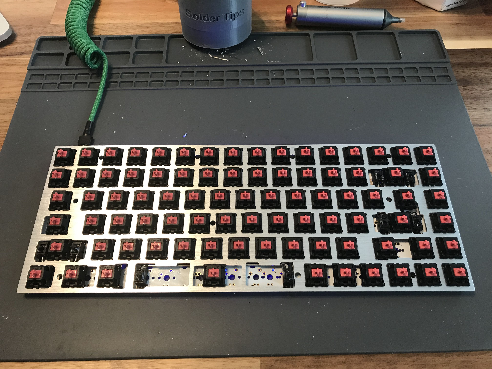

Next I set the assembled PCB into the case with the foam pad underneath (the foam had holes precut so it really only seems to fit one way).  The most challenging part of this was locating a small Phillips style screw driver that has a small diameter shaft to get to a couple of the screws that are in a deep counterbored hole on the bottom of the case (I need to invest in a nice set of these smaller screw drivers).  And now we have arrived at a PCB set in place with a few of the keycaps on.

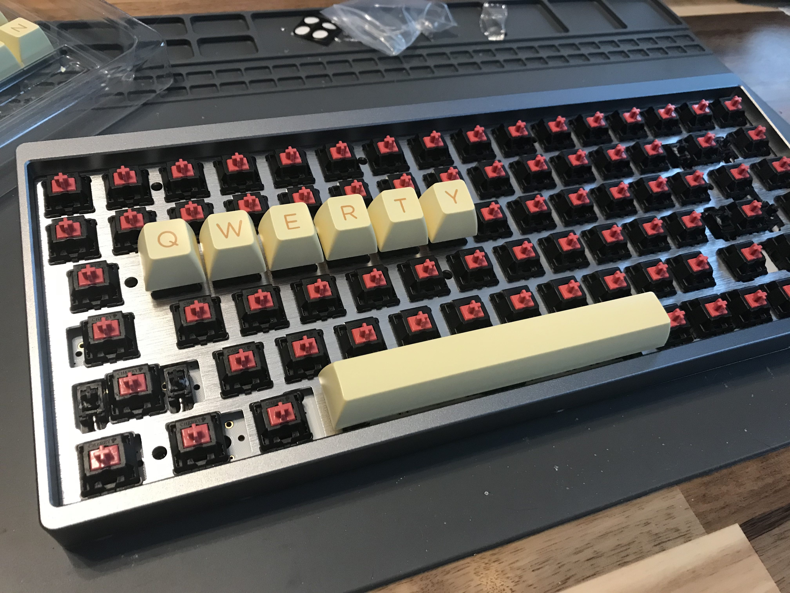

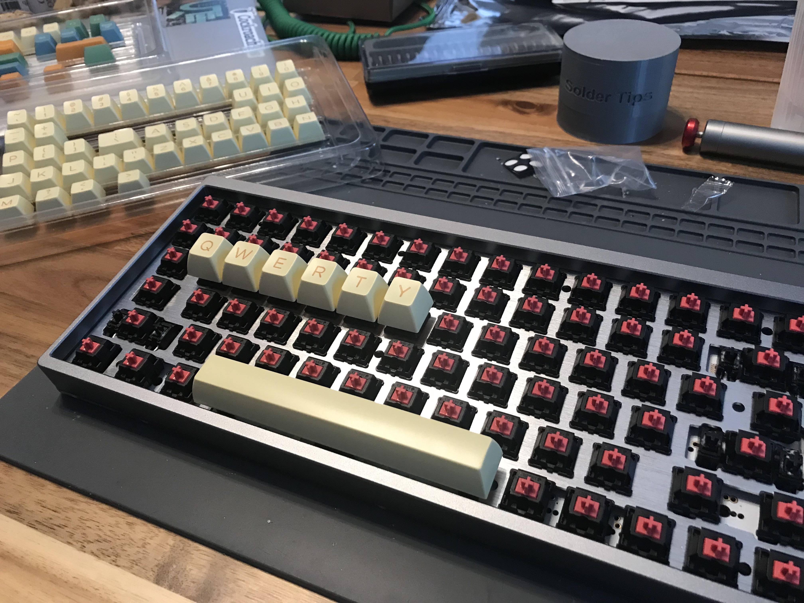

And now is the first take of all the keycaps set in place.  I am really liking the profile of these caps and the feel of the Red Silent switches (really much quieter).

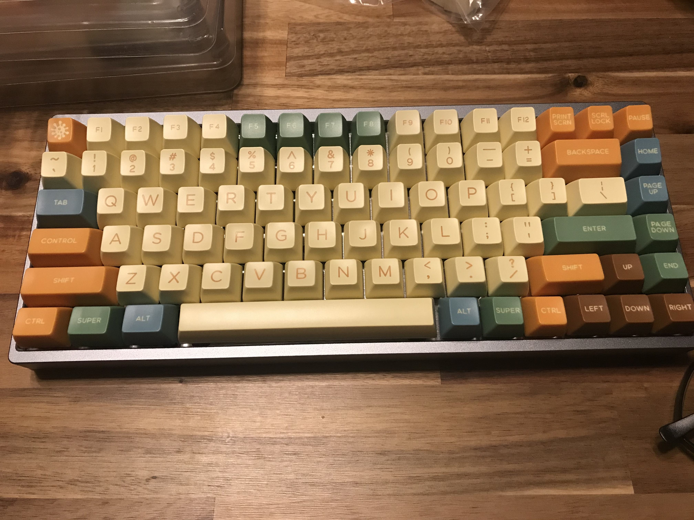

I have since made a couple of small changes to the caps and layout to bring back a Delete key in the upper right corner (I feel like this might be more useful).

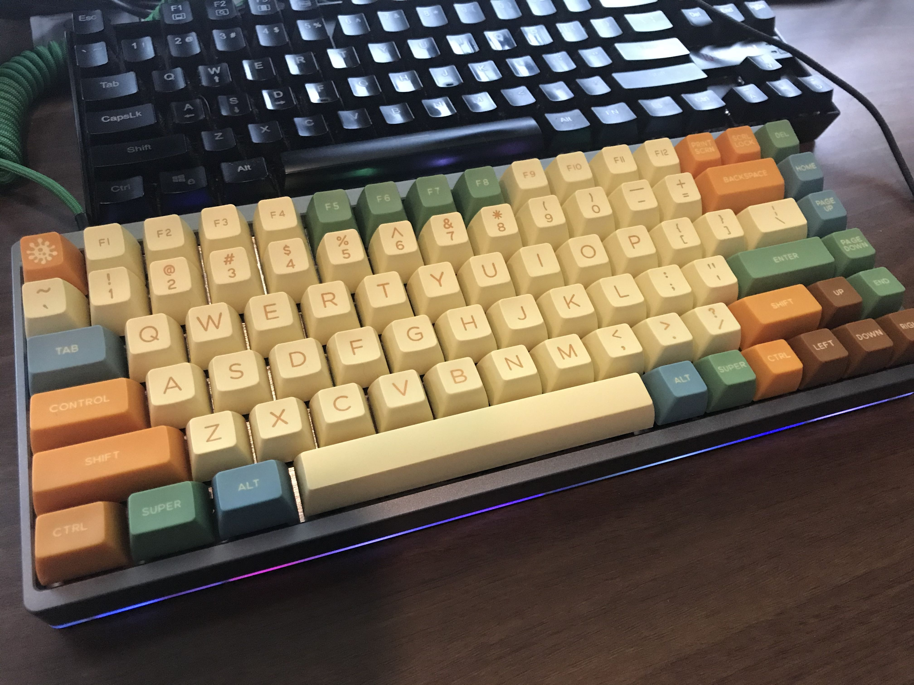

## TODOs
 - Take a side profile pic to show the SA profile.
 - Show the Via setup.
 - Record the sound.  It is really very quiet and smooth compared to the Blue and Reds I've used in the past.